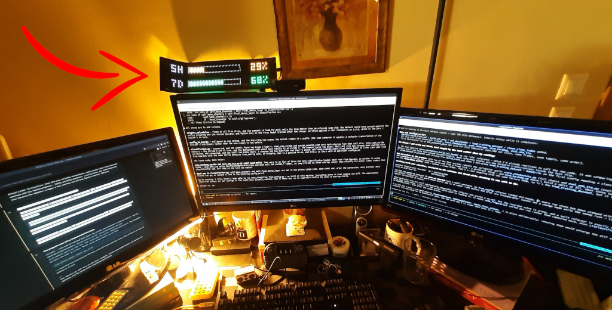
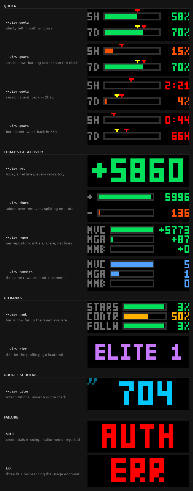

# claude-ipixel

Your remaining Claude quota, live on an iPixel Color LED matrix.



Two rows: how much of the rolling **5-hour session** window you have left, and how much of the rolling **7-day** window. When either runs out, that row switches to a countdown until it refills.

---

## Contents

- [What you're looking at](#what-youre-looking-at)
- [Requirements](#requirements)
- [Install](#install)
- [Usage](#usage)
- [Running it as a service](#running-it-as-a-service)
- [How authorization works](#how-authorization-works)
- [How it works](#how-it-works)
- [Troubleshooting](#troubleshooting)
- [Limitations](#limitations)

---

## What you're looking at



Each row is `label · bar · number`. Both the bar and the number show what is **remaining**, so the bar drains as you work.

| Remaining | Colour |
| --- | --- |
| 50–100% | green |
| 20–50% | amber |
| 0–20% | orange |
| spent | red, bar empty |

When a window is spent, the number becomes the time until it resets:

| Wait | Shown as |
| --- | --- |
| under 24 hours | `2:22` |
| 24 hours or more | `66H` |

The weekly window can be up to 168 hours out. Long waits use an hours suffix rather than days because a 3-pixel-wide `D` is nearly indistinguishable from `0` — `2D18` reads as `2018`.

Two full-panel messages replace the bars on failure:

| Message | Meaning |
| --- | --- |
| `AUTH` | Stored credentials are missing, malformed, or rejected |
| `ERR` | Three consecutive failures reaching the usage endpoint |

A single network blip holds the last good frame rather than blanking the panel; it takes three in a row to show `ERR`.

## Requirements

- **An iPixel Color LED matrix.** Developed against a 64×20 panel (device type 5). All twenty sizes that `pypixelcolor` knows about are supported — from 32×16 up to 448×32, plus the square 64×64 — and the layout adapts to whichever one you have. I personally use [this one](https://share.temu.com/8lxqc2v6BUB)
- **Bluetooth LE** on the host.
- **Python 3.10+** (the code uses `X | None` annotations).
- **A Claude subscription logged in through [Claude Code](https://claude.com/claude-code).** See [How authorization works](#how-authorization-works) — an `ANTHROPIC_API_KEY` will *not* work.

## Install

```bash
git clone https://github.com/<you>/claude-ipixel
cd claude-ipixel
python3 -m venv venv
./venv/bin/pip install -r requirements.txt
```

`pypixelcolor` is the only direct dependency; it pulls in `bleak`, `pillow`, `crccheck` and `websockets`.

Check it renders before you involve any hardware:

```bash
./venv/bin/python service.py --preview /tmp/frame.png
```

That draws your real current usage to a PNG. If it produces a frame with two bars, both the credentials and the endpoint are working, and anything that goes wrong from here is Bluetooth.

## Usage

```bash
./venv/bin/python service.py
```

With no arguments it scans for your panel, connects, and redraws every 60 seconds.

| Flag | Default | What |
| --- | --- | --- |
| `--address AA:BB:..` | scan | Panel's BLE address; skips the scan |
| `--interval N` | `60` | Seconds between polls |
| `--once` | | Draw a single frame and exit |
| `--preview PATH` | | Render to a PNG instead of the panel — no Bluetooth needed |
| `--size WxH` | `64x20` | Panel size for `--preview` only; read from the device otherwise |

### Finding your panel

You do not normally need to. Panels advertise as `LED_BLE_<last 4 bytes of the MAC>`, so the service scans for 8 seconds, picks the `LED_BLE_*` device with the strongest signal, and logs what it chose:

```
INFO scanning 8s for LED_BLE_* panels
INFO found LED_BLE_0C7E39FB at 5B:18:0C:7E:39:FB (-63 dBm)
INFO connected to 5B:18:0C:7E:39:FB (64x20)
```

If several panels are in range it uses the closest and says so. Pass `--address` to pin a specific one — but note these panels use a **random** BLE address that changes when the device power-cycles, so a pinned address can go stale. The scan is rerun on every reconnect precisely so that recovers on its own.

To see what is advertising nearby:

```bash
./venv/bin/python -m pypixelcolor --scan
```

### Previewing other panel sizes

`--size` only affects `--preview`; on real hardware the dimensions are read from the device itself.

```bash
./venv/bin/python service.py --preview /tmp/big.png --size 128x32
./venv/bin/python service.py --preview /tmp/small.png --size 32x16
```

The layout picks the largest whole-pixel font scale the panel's height and width allow, then trades scale back down if that is what it takes to keep a readable bar. Panels too narrow for a bar at any scale (32 pixels wide) show the numbers alone.

## Running it as a service

`claude-ipixel.service` is a systemd **user** unit — user, not system, because it needs to read *your* `~/.claude/.credentials.json`.

Edit the two absolute paths in it to match your checkout, then:

```bash
ln -s "$PWD/claude-ipixel.service" ~/.config/systemd/user/
systemctl --user daemon-reload
systemctl --user enable --now claude-ipixel
```

Watch it:

```bash
systemctl --user status claude-ipixel
journalctl --user -u claude-ipixel -f
```

To keep the panel running while you are logged out:

```bash
loginctl enable-linger $USER
```

It restarts automatically 15 seconds after any crash, and recovers from Bluetooth dropouts on its own without needing a restart.

## How authorization works

This is the part worth understanding before you run it.

### What it reads

Claude Code stores an OAuth credential at `~/.claude/.credentials.json` when you log in with your Claude subscription. This service reads the `claudeAiOauth.accessToken` field out of that file and sends it as a bearer token. It needs no login of its own, no config, and no secrets in the repo — if `claude` works on this machine, this works.

### Why an API key won't do

The usage endpoint is OAuth-only. It reports quota against your *subscription* (Pro, Max, Team), and API keys bill per token rather than drawing on those windows, so there is nothing for it to report. Setting `ANTHROPIC_API_KEY` has no effect here.

### What it deliberately does not do

**The credentials file is read fresh on every poll and never written to.**

That access token expires roughly every 8 hours. Claude Code refreshes it itself, using a lock-and-compare-and-swap protocol (`~/.claude/.oauth_refresh.lock`) so that its own concurrent sessions don't clobber each other. This service could join that protocol — but a bug in a hobby project that races the refresh could rotate the token out from under Claude Code and log you out of your editor.

So it doesn't. It takes whatever is on disk and reports honestly when that is stale.

**The practical consequence:** if you don't run `claude` for longer than the token's lifetime, it expires, the endpoint returns 401, and the panel shows `AUTH` until you next use Claude Code — which refreshes the token as a side effect and brings the panel back within one poll. In day-to-day use, where the panel exists precisely because you *are* using Claude, this rarely comes up.

That is the deliberate trade: a visible, self-healing error over any chance of breaking your login.

## How it works

`usage.py` reads the token and calls:

```http
GET https://api.anthropic.com/api/oauth/usage
Authorization: Bearer <token>
anthropic-beta: oauth-2025-04-20
```

The response carries `five_hour` and `seven_day` objects, each with a `utilization` percentage and a `resets_at` timestamp. That is the entire data source — two numbers and two timestamps.

`display.py` renders an RGB image at the panel's exact dimensions using a hand-rolled 3×5 bitmap font. PIL's bundled fonts start around 11 pixels tall, which does not fit a 16-pixel panel split into two rows, so the glyphs are defined as bitmaps and scaled by whole pixels.

`service.py` polls, renders, and pushes the frame as a PNG over BLE via `pypixelcolor`. **The panel is only redrawn when the rendered frame actually changes**, so an idle display generates no Bluetooth traffic at all.

## Troubleshooting

| Symptom | Cause |
| --- | --- |
| Panel shows `AUTH` | Token expired or missing. Run any `claude` command to refresh it, or `claude auth` if you were never logged in. |
| Panel shows `ERR` | Three consecutive failures reaching the endpoint. Check connectivity; it clears itself on the next success. |
| `no LED_BLE_* panel in range -- pass --address` | Panel is off, out of range, or still connected to another client — the phone app holds an exclusive connection, so close it. |
| `--preview` works but the panel never updates | The problem is Bluetooth, not credentials. Confirm with `./venv/bin/python -m pypixelcolor --scan`. |
| Repeated `device error, retrying` | Usually BLE congestion. It reconnects every 15s by itself; `systemctl --user restart bluetooth` if it persists. |
| Service dies immediately under systemd | Almost always the two absolute paths in the unit file still pointing at the wrong directory. |

## Limitations

- The usage endpoint is undocumented and unversioned. It may change or disappear without warning.
- Only the 5-hour and 7-day windows are drawn. The response also carries per-model and spend fields, which are ignored.
- Bluetooth LE only. Panels with WiFi firmware are not addressed over the network.
- Not affiliated with, endorsed by, or supported by Anthropic.

## License

GPL-3.0 — see [LICENSE](LICENSE).

Built on [pypixelcolor](https://github.com/lucagoc/pypixelcolor) by Lucas Balmès, which does all the actual talking to the hardware.
