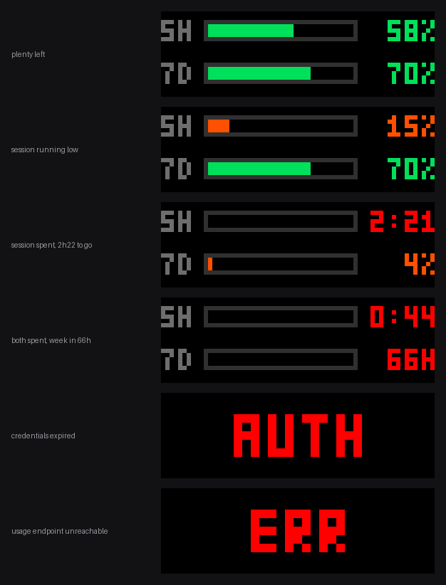

# claude-usage-led

Your remaining Claude quota, on an [iPixel Color](https://github.com/lucagoc/pypixelcolor) LED matrix.

Two bars: how much of the rolling **5-hour session** window is left, and how much of the rolling **7-day** window. When either runs out, that row switches to a countdown until it refills.



## What you're looking at

Each row is `label · bar · number`, and both the bar and the number show what's **remaining** — the bar drains as you work.

| Remaining | Colour |
| --- | --- |
| 50–100% | green |
| 20–50% | amber |
| 0–20% | orange |
| spent | red, bar empty |

When a window is spent the number becomes the time until it resets: `2:22` for anything under a day, `66H` above that. The weekly window can be up to 168 hours out, which is why long waits use an hours suffix rather than days — a 3-pixel-wide `D` is nearly indistinguishable from `0`.

Two full-panel messages replace the bars on failure: **`AUTH`** when the stored credentials are missing or rejected, and **`ERR`** after three consecutive failures to reach the usage endpoint. A single blip holds the last good frame rather than blanking the panel.

## Requirements

- An iPixel Color LED matrix. Developed against a **64×20** panel (device type 5); the renderer is laid out for exactly those dimensions.
- Bluetooth LE on the host.
- Python 3.10+ (uses `X | None` annotations).
- A Claude subscription logged in through [Claude Code](https://claude.com/claude-code) — this reads the OAuth credentials that `claude` already stores. An `ANTHROPIC_API_KEY` will **not** work; the usage endpoint is OAuth-only.

## Install

```bash
python3 -m venv venv
./venv/bin/pip install pypixelcolor
```

That is the only dependency — it pulls in `bleak`, `pillow`, `crccheck` and `websockets`.

Find your panel's BLE address if you don't know it:

```bash
bluetoothctl scan on
```

## Usage

```bash
./venv/bin/python service.py --address AA:BB:CC:DD:EE:FF
```

| Flag | Default | What |
| --- | --- | --- |
| `--address` | baked-in MAC | Panel's BLE address |
| `--interval` | `60` | Seconds between polls |
| `--once` | | Draw a single frame and exit |
| `--preview PATH` | | Render to a PNG instead of the panel — no Bluetooth needed |

`--preview` is the fastest way to check a layout change:

```bash
./venv/bin/python service.py --preview /tmp/frame.png
```

The panel is only redrawn when the rendered frame actually changes, so an idle display generates no BLE traffic.

## Running it as a service

`claude-ipixel.service` is a systemd **user** unit. Edit the two absolute paths in it to match your checkout, then:

```bash
ln -s "$PWD/claude-ipixel.service" ~/.config/systemd/user/
systemctl --user daemon-reload
systemctl --user enable --now claude-ipixel
journalctl --user -u claude-ipixel -f
```

If you want the panel running while you're logged out, `loginctl enable-linger $USER`.

## How it works

`usage.py` reads the access token from `~/.claude/.credentials.json` and calls:

```
GET https://api.anthropic.com/api/oauth/usage
Authorization: Bearer <token>
anthropic-beta: oauth-2025-04-20
```

The response carries `five_hour` and `seven_day` objects, each with a `utilization` percentage and a `resets_at` timestamp. That's the whole data source.

`display.py` renders a 64×20 RGB image with a hand-rolled 3×5 bitmap font — PIL's bundled fonts are far too tall for a 20-pixel panel split into two rows. `service.py` polls, renders, and pushes the PNG over BLE via `pypixelcolor`.

### A note on credentials

The credentials file is **read fresh on every poll and never written back**. Claude Code refreshes that token itself, roughly every 8 hours, using a lock-and-compare-and-swap protocol across its own processes; this service deliberately stays out of that and simply picks up whatever is on disk.

The practical consequence: if you don't run `claude` for longer than the token's lifetime, the token expires, the endpoint returns 401, and the panel shows `AUTH` until you next use Claude Code. That's the deliberate trade — a stale-but-honest error instead of any risk of clobbering your login.

## Limitations

- Layout is hard-coded to 64×20. Other panel sizes need the constants at the top of `display.py` reworked.
- The usage endpoint is undocumented and unversioned. It may change without warning.
- Not affiliated with or endorsed by Anthropic.

## License

MIT
